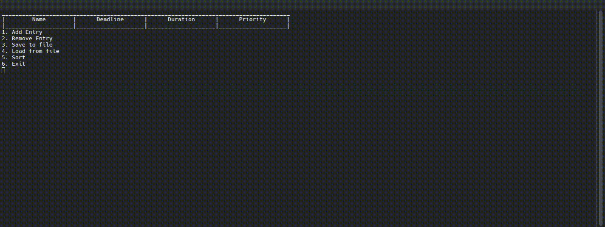

# TaskPlanner

Command line application allowing for creating a task list.

## Features

* Adding and removing tasks via command line
* Saving to and loading from files
* Sorting tasks with EDF algorithm
* Logging to a file in case of an error

## Tech stack

- C++23
- STL

### Dependencies
- [**ModernCppStarter**](https://github.com/TheLartians/ModernCppStarter/): CMake project starter template.
- [**CPM.cmake**](https://github.com/cpm-cmake/CPM.cmake/): Setup-free CMake dependency management.
- [**fmt**](https://github.com/fmtlib/fmt): is an open-source formatting library providing a fast and safe alternative to C stdio and C++ iostreams.
- [**GoogleTest**](https://github.com/google/googletest): Google's C++ test framework.

## Usage

### Use precompiled binaries

Download the current [**release**](https://github.com/J-Cieplinski/TaskPlanner/releases) binary for your system and run it.

*Binaries may not be compiled from the newest source due to Github actions free plan limitations*

### Compile from source yourself

Make sure you have CMake and compiler supporting C++23 standard for your system installed
1. Clone repository
2. Compile using cmake `cd TaskPlanner && mkdir build && cd build && cmake ../standalone/ && make`
3. run `TaskPlannerApp`